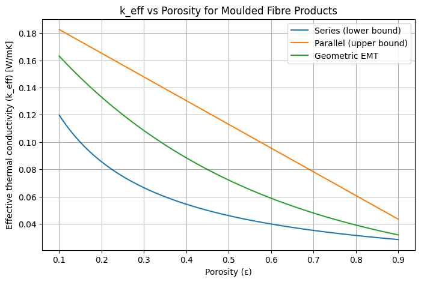
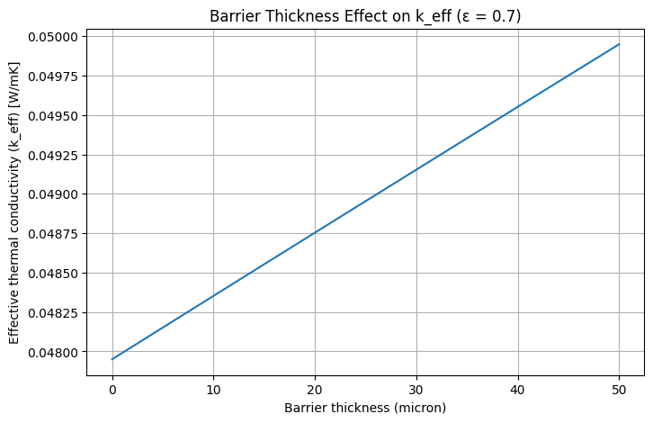

# MFP-Thermal-EMT  
Effective Medium Theory (EMT) Modelling for the Thermal Conductivity of Porous Moulded Fibre Products

---

## 1. Justification  
Moulded Fibre Products (MFPs) are increasingly used as sustainable substitutes for petroleum-based plastics in packaging. Made from natural cellulose fibres, they are fully recyclable, biodegradable, and compatible with circular-economy goals [1]. Their widespread adoption in agri-food applications highlights the need to better understand their thermo-physical behaviour. 

Structurally, MFPs form high-porosity cellulose fibre networks, where heat transfer depends on three key elements: 

1. The thermal conductivity of the solid fibres, 

2. The air-filled pore structure, and 

3. The presence of thin barrier coatings (e.g., PLA, PVOH) applied for moisture and grease resistance [2,3]. 

Because porosity strongly influences the effective thermal conductivity (k_eff), understanding the relationship between fibre network structure, coatings, and heat transfer is essential for designing packaging with appropriate thermal resistance, food-contact safety, and oven/heating performance. Lightweight analytical models—such as series/parallel bounds and Effective Medium Theory (EMT) provide fast, physics-based predictions of (k_eff), avoiding the need for complex CFD/FEM simulations [3].

## 2. Problem Statement  
Moulded fibre materials exhibit complex heat-transfer behaviour due to their two-phase composition: 

1. A moderately conductive cellulose fibre phase. 

2. A highly insulating air phase within the pores. 

The random packing of fibres creates discontinuous heat paths and makes k_eff highly sensitive to porosity: low-density (high-void) structures show lower thermal conductivity, while compaction increases heat flow by forming additional solid contact points [2,3]. 

To improve liquid and grease resistance, MFPs are commonly coated with thin polymer barrier layers such as PLA or PVOH. While these coatings are essential for surface protection, their impact on thermal conductivity remains insufficiently quantified [4]. Due to their small thickness (5–50 µm), they are expected to have a modest but non-negligible effect on k_eff, particularly through pore sealing and altered surface conduction.

---

## 3. Rationale for Using Effective Medium Theory (EMT)  
Effective Medium Theory provides **closed-form analytical expressions** that approximate the effective thermal conductivity of heterogeneous media.

EMT is appropriate because:

- MFPs behave like **random fibrous porous materials**.  
- EMT offers **upper and lower bounds** for property estimation.  
- It is computationally light, intuitive, and ideal for **early-stage material screening**.
- It forms the theoretical foundation before switching to FEM/CFD or microstructure modelling.

The project uses three classical EMT formulations:

- **Series model** → lower bound  
- **Parallel model** → upper bound  
- **Geometric mean model** → realistic intermediate behaviour \[5\] 

Additionally, a **1D layer-in-series model** is applied to incorporate polymer barrier coatings.

---

##  4. Design & Methodology  

### **4.1 Model Implementation**
### 
The mathematical models used in this project are implemented in `src/emt_models.py`.  
The module includes four core functions:

- `k_series(k_fibre, k_air, porosity)`  
- `k_parallel(k_fibre, k_air, porosity)`  
- `k_geometric(k_fibre, k_air, porosity)`  
- `keff_with_barrier(k_core, L_core, k_barrier, L_barrier)`

These functions correspond to the classical analytical formulations commonly used to approximate heat conduction in porous two-phase media.  
The first three functions (series, parallel, geometric mean) provide lower bound, upper bound, and realistic intermediate predictions of the effective thermal conductivity of fibre–air mixtures.

The `keff_with_barrier` function implements a simple **1D thermal resistance model**, enabling evaluation of how a thin polymer coating layer alters the overall thermal behaviour of the MFP structure.

Together, these formulations provide a lightweight but physically meaningful framework for analysing structure–property relationships in moulded fibre materials.


---

### **4.2 Parametric Studies**
A Jupyter Notebook (`notebooks/01_emt_mfp_demo.ipynb`) generates:

- **k_eff vs. porosity curves** for the three EMT models  
- **Barrier thickness vs. total k_eff** for 0–50 µm coatings  
- Optional comparisons for different fibre materials  

---

### **4.3 Visualisation**
Plots illustrate:

- Upper/lower conductivity bounds  
- Realistic intermediate behaviour (geometric mean)  
- Sensitivity of thermal conductivity to porosity  
- Thermal impact of surface barrier engineering  

### 4.4 Assumptions and Reference Values 

Fibre thermal conductivity (k_fibre) = 0.20 W/m·K [6] 

Air thermal conductivity (k_air) = 0.026 W/m·K [7] 

Polymer barrier conductivity ( k_poly)= 0.30 W/m·K [8] 

Porosity (ε) = 0.1–0.9 [9] 

Barrier thickness= 5–50 µm [10] 
---

## 5.Key Result Visualizations

  ### 5.1. k_eff vs Porosity



Figure: Effective thermal conductivity (k_eff) as a function of porosity (ε) for moulded fibre products.
As porosity increases, k_eff decreases significantly across all models. The series model provides a lower bound, assuming heat flows only through air or fibre in sequence. This highlights how increasing porosity reduces thermal performance, a key consideration in material design [6]. 
### 5.2. Barrier Thickness Effect on Thermal Conductivity



Figure: Effect of polymer barrier thickness on total effective thermal conductivity (k_eff) for ε = 0.7.
Increasing the coating thickness enhances the effective conductivity of the fibers, thereby raising the composite’s overall keff [7]. ---
## 6. Future Work  

Potential extensions include:

- **Temperature-dependent conductivity models**  
- **Different fibre chemistries** (cellulose, lignin-rich, mineral-filled)  
- **2D/3D random fibre network generation**  
- **Finite Element (FEM) microstructure simulations** for validation  
- **Coupling with moisture diffusion or WVTR models**  
- **Streamlit dashboard** for interactive materials design  


---
## Refences
1. Humbert, C., Jadeau-Guichard, H., & Nicolay, P. (2024). Moulded-Pulp Packaging: A Straightforward Method for Quickly Designing, Manufacturing and Testing Complex Shapes for Crash Protection Pads. Applied Sciences, 14(24), 11516. 

2. Debnath, M., Sarder, R., Pal, L., & Hubbe, M. A. (2022). Molded pulp products for sustainable packaging: production rate challenges and product opportunities. BioResources, 17(2), 3810. 

3. Liu, K., & Wang, Y. Pore Structure Characterization and Effective Thermal Conductivity Calculation Model of Fibrous Building Thermal Insulation Materials Based on X-Ray Tomography. Available at SSRN 4712349. 

4. Tarnowiecka-Kuca, A., Peeters, R., Bamps, B., Stobińska, M., Kamola, P., Wierzchowski, A., ... & Mizielińska, M. (2023). Paper coatings based on polyvinyl alcohol and cellulose nanocrystals using various coating techniques and determination of their barrier properties. Coatings, 13(11), 1975. 

5. Wang, W., Fu, Q., Ge, J., Xu, S., Liu, Q., Zhang, J., & Shan, H. (2024). Advancements in thermal insulation through ceramic micro-nanofiber materials. Molecules, 29(10), 2279. 

6. Glass, S., & Zelinka, S. (2021). Moisture relations and physical properties of wood. Chapter 4 in FPL-GTR-282, 4-1. 

7. Perumal, S., Rajendrian, S., Venkatraman, V., Sundaresan, D., & Pandiyan, L. (2020). Experimental study about thermal resistance of windows with air gap between two glasses used in single houses. Thermal Science, 24(1 Part B), 515-518. 

8. Wei, Q., & Yang, D. (2023). A self-healing polyvinyl alcohol-based composite with high thermal conductivity and excellent mechanical properties. Composites Communications, 39, 101561. 

9. Semple, K. E., Zhou, C., Rojas, O. J., Nkeuwa, W. N., & Dai, C. (2022). Moulded pulp fibers for disposable food packaging: A state-of-the-art review. Food Packaging and Shelf Life, 33, 100908. 

 10.Apicella, A., Barbato, A., Garofalo, E., Incarnato, L., & Scarfato, P. (2022). Effect of PVOH/PLA+ wax coatings on physical and functional properties of biodegradable food packaging films. Polymers, 14(5), 935. 

11.    Sekino, N. (2016). Density dependence in the thermal conductivity of cellulose fiber mats and wood shavings mats: investigation of the apparent thermal conductivity of coarse pores. Journal of wood science, 62(1), 20-26. 

12.    Benveniste, Y., & Miloh, T. (1991). On the effective thermal conductivity of coated short‐fiber composites. Journal of Applied Physics, 69(3), 1337-1344. 

## How to Run

```bash
git clone https://github.com/senacakici/mfp-thermal-emt.git
cd mfp-thermal-emt
python -m venv .venv
.\.venv\Scripts\activate      # Windows
pip install -r requirements.txt
jupyter notebook
